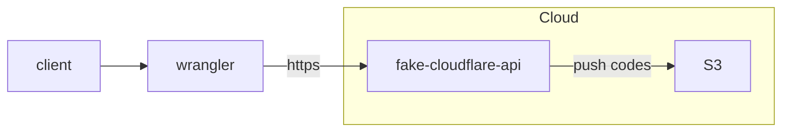

# fake-cloudflare-api

The "Fake Cloudflare API" is a tool designed to simplify the deployment of 
[Cloudflare Workers](https://workers.cloudflare.com/) by emulating the functionality 
of the Cloudflare API, allowing seamless integration with the default Cloudflare CLI, [Wrangler](https://github.com/cloudflare/workers-sdk#readme).

## Overview

1. [Installation](#installation)
2. [Running the Server](#running-the-server)
3. [How to use](#how-to-use)
4. [How it works](#how-it-works)

## Installation
First, clone this project: git clone https://github.com/clementreiffers/fake-cloudflare-api.git.
Then navigate to the directory: cd fake-cloudflare-api and install all dependencies by running yarn or npm i.

Use aws configure to connect to your S3 bucket.

> **Note**:
> This example has been coded using Scaleway Object Storage, which is compatible with AWS S3.
> If you are using scaleway, follow this tutorial to proceed with the AWS CLI configuration.

## Running the Server

You can run the server directly using: `yarn start` or `npm start`.
There is also a dev mode available. Run: `yarn dev` or `npm dev`. It automatically restarts 
the server if you change a file using nodemon.

## How to Use

> **Note**: The login feature has not been implemented yet. Currently, the server only 
> allows publishing code to a server.

Once you have implemented your first worker (see examples here), you can use this fake API.

Previously, when publishing to the Cloudflare server, you needed to use the wrangler publish command, which did it automatically.

Now, if you run this server using yarn start, you can run `CLOUDFLARE_API_BASE_URL=http://YOUR_SERVER:3000/client/v4 wrangler publish`.
Wrangler will build your project and send it to the server. Then, the server will directly send it to your S3 bucket.

## How It Works

Imagine someone who has finished coding their own Worker. They will use Wrangler to push their code, which in turn will 
fetch this API. This API will then publish the code directly to an S3 bucket.

